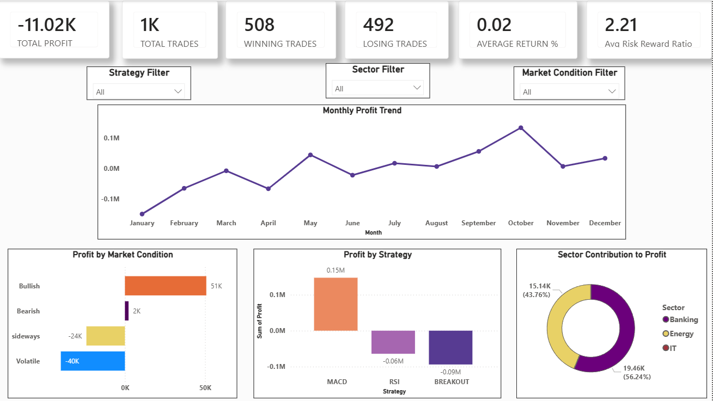
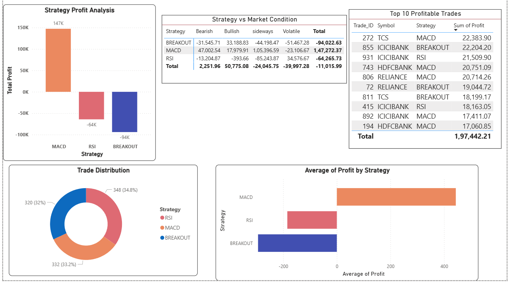
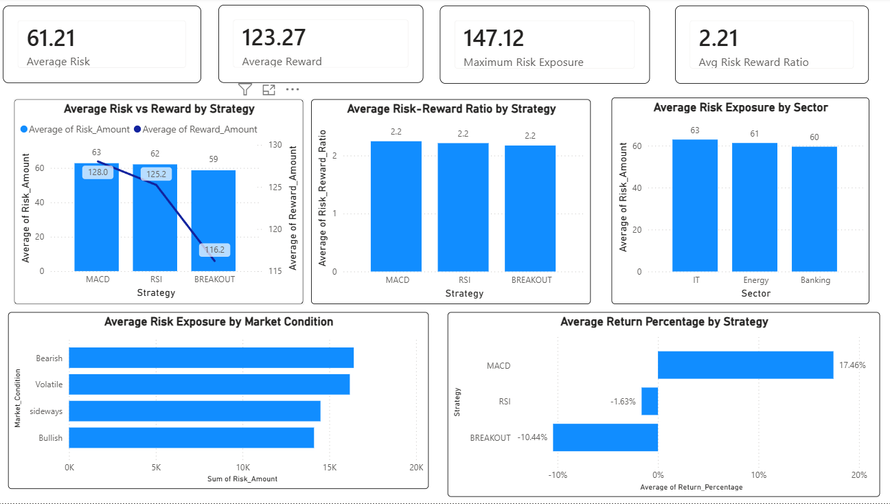
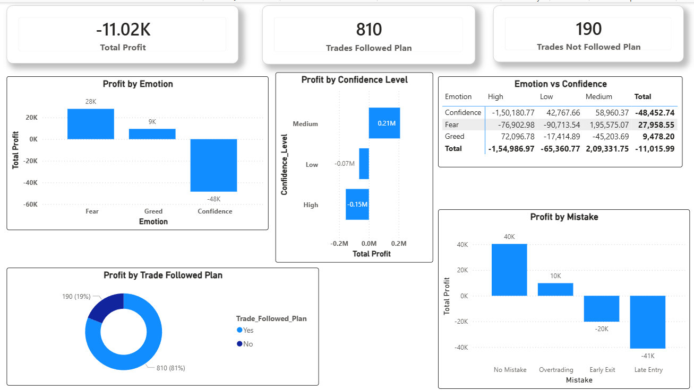

# Trader Performance Intelligence & Risk Analytics Platform

## Project Overview

This project analyzes trading performance, strategy effectiveness, risk management, and trader behavior using Python, SQL, MySQL, and Power BI.

The objective is to transform raw trading data into actionable insights through interactive dashboards and business intelligence reporting.

---

## Tools & Technologies

- Python
- Pandas
- NumPy
- SQL
- MySQL
- Power BI
- DAX

---

## Dataset Information

- Total Records: 1,000
- Features: 24
- Domain: Trading Analytics

Key Attributes:

- Trade_ID
- Trade_Date
- Strategy
- Sector
- Market_Condition
- Profit
- Risk_Amount
- Reward_Amount
- Risk_Reward_Ratio
- Confidence_Level
- Emotion
- Mistake
- Win_Loss

---

## Dashboard Pages

###  Executive Summary Dashboard

###  Strategy & Performance Analytics

###  Risk Analytics Dashboard

###  Behavioral Analytics Dashboard

---

## Key Insights

- MACD strategy generated the highest overall profitability.
- Risk-Reward Ratio remained above 2 across major strategies.
- Market conditions significantly influenced trading outcomes.
- Emotional behavior directly impacted trading performance.
- Overtrading and late entries negatively affected profitability.
- Following a structured trading plan improved overall consistency.

---

## Repository Contents

- trading_dataset_final.csv
- Trader_Performance_Analytics.pbix
- Screenshots/
- README.md

---

## Author

**Mayuresh Ravindra Patil**

B.Tech Electrical Engineering | Data Analytics Enthusiast

### Skills

- Power BI
- SQL
- Python
- Excel
- Data Visualization
- Dashboard Development
- Data Cleaning
- Business Analytics

### LinkedIn

www.linkedin.com/in/mayuresh-patil-8b723a196

